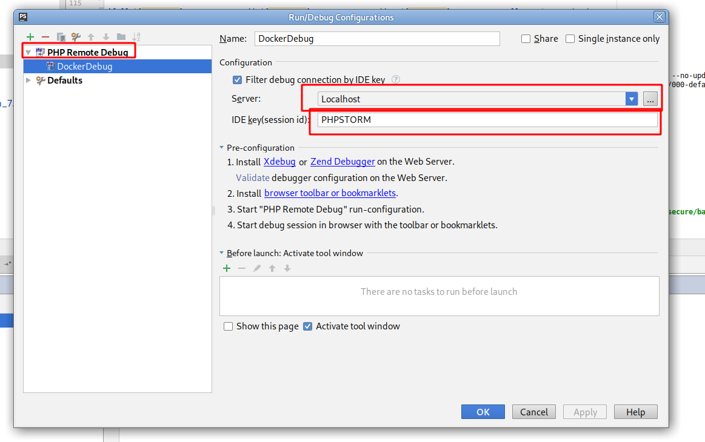
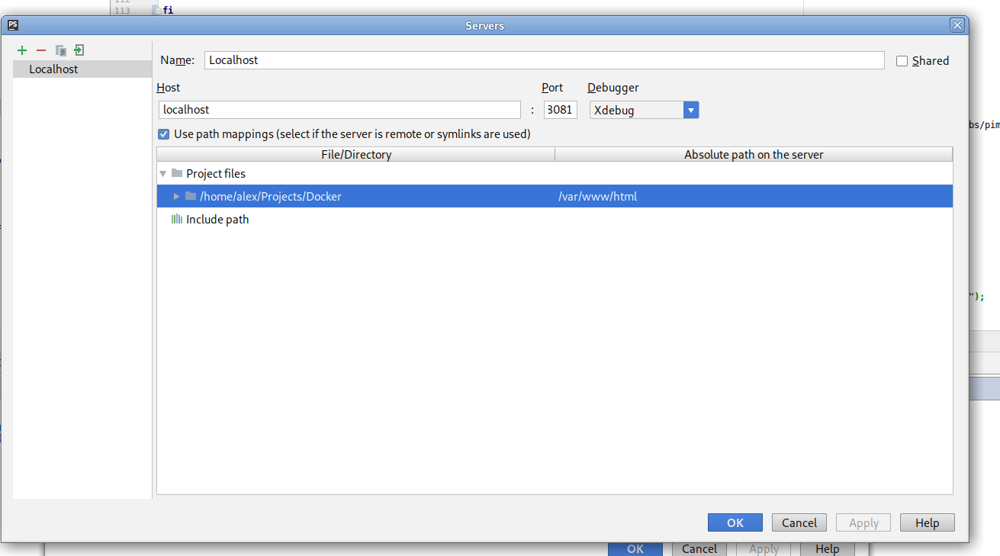

# Опис конфігурації Docker-контейнерів 

## Структура проекту

| Папка/файл                | Призначення              |
|:--------------------------|:-------------------------| 
|**``docker-run.sh``**      | основний скрипт для запуску всіх контейнерів |     
|**``.env``**               | основний конфігураційний файл |  
| ``data``                  | папка з даними користувача         | 
|``proxy_server``           | контейнер для проксі (Apache)   |     
|``web_server``             | контейнер для веб-серверу (Apache + PHP)   |     
|``docker-apache.sh``       | підключення до контейнеру з веб-сервером |   
|``docker-proxy.sh``        | підключення до контейнеру з проксі-сервером  |     
|``docker-mysql.sh``        | підключення до контейнеру з MySQL-сервером  |       
|``docker-clean.sh``        | скрипт очищення завантажених Docker-образів |     
|``docker-compose.yml``     | налаштування для docker-compose  |     
|``.dockerignore``          | список файлів які не повинні попадати в контенера Docker  |     
|``.gitattributes``         | налаштування для Git |     
|``.gitignore``             | налаштування файлів для ігнорування додавання в Git |     


## Порядок встановлення
1 .  Встановити [Docker](https://docs.docker.com/install/linux/docker-ce/debian/) і обов'язково виконати інструкції з  https://docs.docker.com/install/linux/linux-postinstall/ 
це дасть змогу запускати докер і апач в докері від основного користувача в системі і не буде проблем з правами доступу. 

2 . Для запуску і перезапуску зручно використовувати  скрипт `docker-run.sh` даний скрипт робить перезборку і запуск Docker контейнерів.

3 . У випадку будь-яких проблем можна використовувати скрипт  `docker-сlean.sh` він видаляє всі образи, контейнери і розділи.

4 . Початкове налаштування докера полягає в налаштуванні параметрів файлу `.env`

### Опис основних параметрів 

**DOMAIN** - вказує на папку в яку буде склонований проект. У випадку клонування ця папка буде задана як _DocumentRoot_. Для проксування використовується домен з іменем який вказаний в  DOMAIN. 
_DocumentRoot_ без клонування проектів в контейнері має шлях _/var/www/html_ 

>DOMAIN=localhost

>Заченння за умовчанням _localhost_

**PLATTFORM** - вказує на тип платформи, вливає на команди після розгортання контейнеру.
Необхідно вказати платформу TREOPIM, TREOCORE, TREODAM.

>PLATTFORM=TREOPIM

>Заченння за умовчанням _TREOPIM_

>Допустимі значення TREOPIM, TREOCORE, TREODAM

**APACHE_PORT** - порт на якому доступний веб-сервер Apache. Сайт доступний за адресою [http://localhost:8081]() 

>APACHE_PORT=8081

>Заченння за умовчанням _8081_
 
 **MAILHOG_PORT** - порт для MailHog  доступний по адресі  [http://localhost:8025](), призначений для перегляду почти. Також всі системні помилки контейнеру будуть надсилатися на почту в  MailHog.

>MAILHOG_PORT=8025

>Заченння за умовчанням _8025_

**PHPMYADMIN_PORT** - порт підключення до phpMyAdmin  доступний по адресі  [http://localhost:8084]()

> PHPMYADMIN_PORT=8084

>Заченння за умовчанням _8084_

**MYSQL_PORT** - порт для підключення до MySQL серверу зовні, наприклад через MySQL Workbench. Параметри підключення host: localhost port: 13306

>MYSQL_PORT=1306

>Заченння за умовчанням _1306_

**PROXY_PORT=8089** - порт для переходу на сайт з захищеним доменом через проксі [http://localhost:8089]().
При переході по даному адресу, звернення буде автоматично трансльовано в  передід по живому домену, локально в хости нічого прописувати не треба 

>PROXY_PORT=8089

>Заченння за умовчанням _8089_

**PHP_VER** - версія PHP в контейнері. Для Apache і для CLI.

>PHP_VER=7.3

>Заченння за умовчанням _7.3_

>Допустимі значення 5.6, 7.0, 7.1, 7.2, 7.3


 **MYSQL_DATABASE** - ім'я локальної БД в конейнері database_server. 

>MYSQL_DATABASE=db

>Заченння за умовчанням _db_

**MYSQL_USER** - користувач для локальної БД в конейнері database_server. 

>MYSQL_USER=db

>Заченння за умовчанням _db_

**MYSQL_PASSWORD** - пароль користувач для локальної БД в конейнері database_server. 

>MYSQL_PASSWORD=db

>Заченння за умовчанням _db_

**MYSQL_PASSWORD** - пароль користувач root для локальної БД в конейнері database_server, цей пароль можна використовувати для підключення зовні.  

>MYSQL_ROOT_PASSWORD=root

**MYSQL_REMOTE_DATABASE** - ім'я віддаленої бази даних, необхідно задавати для стягування БД з віддаленого сервера. 

>MYSQL_REMOTE_DATABASE=docker

**MYSQL_REMOTE_USER**  - користувач для БД для підключення до віддаленого серверу MYSQL_REMOTE_HOST. 

>MYSQL_REMOTE_USER=docker

**MYSQL_REMOTE_PASSWORD** - пароль користувача БД для підключення до віддаленого серверу MYSQL_REMOTE_HOST.

>MYSQL_REMOTE_PASSWORD=docker

**MYSQL_REMOTE_HOST** - віддалений хост для клонування БД. Порт використовується стандатрний 3306. 

>MYSQL_REMOTE_HOST=db.treotest.com

При запуску система автоматично перевірить чи раніше був розгорнута БД, якщо ні то спробує отримати останній бекап з папки /data/dumps/*.sql , 
якщо бекапів в папці не знайдено, відбувається спроба отримати БД з віддаленого сереву MySQL. 
При першому запуску докера це займає кілька хв, тому перший  запуск може тривати до 10 хв, БД зберігається локально в /data/mysql .

### Структура проекту в Docker

Основний проект повинен бути розміщений в кореневій папці. Тобто папка проекту /home/project, а папка з докером поивнна бути розміщенна в папці /home/project/docker.

```./
└── home
    └── localhost - папка з проектом
        └── docker - папка з Docker
        │   ├── data
        │   │   ├── dumps
        │   │   ├── images
        │   │   ├── logs
        │   │   └── mysql
        │   ├── proxy_server
        │   └── web_server
        │       ├── entrypoint.d
        │       ├── php5.6
        │       ├── php7.0
        │       ├── php7.1
        │       ├── php7.2
        │       ├── php7.3
        │       └── scripts
        └── index.php - файл проекту знаходиться в папці project1
```

- Хост бази даних для підключення в середині докеру **database_server**.
- Север відправки почти  **mail.server:1025**.
- змінні середовища, для того щоб розуміти, що ми в докері ENV=DOCKER та SHOPWARE_ENV=dev.

### Підключення до контейнерів запущених в Docker

В системі є наступні допоміжні скрипти  docker-apache(mysql|proxy).sh
Дані скрипти призначені для підключення до відповідного контейнеру. 


### Особливості контейнерів запущених в Docker

1 . Для того, щоб почта перенаправлялася в  MAILHOG в системі налаштувати smtp сервер **mail.server:1025**

2 . Налаштування PHP знаходяться в папці ./web_server/phpX.X/config
Після змін варто перезапустити контейнер

3 . Додавання кронів кронів для користувача www-data повинно здіснюватися в форматі  
			`crontab -l -u www-data | {
				cat;
				printf "\n* * * * * КОМАНДА\n";
			} | crontab -u www-data -`


### Вирішення проблем 
1. Валідаія в PhphStorm проходить, але брекпоїнти в не спрацьовують.  В налаштуваннях xdebug встановлено xdebug.remote_connect_back = 1, це означає, що  xdebug підключається автоматично на той IP з якого був відпралений запит. Якщо валідація в PhphStorm працює, а підключення нема, то потрібно перевірити чи відкритий порт 9000 на хост машині.
Відкрити порт можна за допомогою команди ``ufw allow 9900``.

2. Також треба перевірити налаштування PhphStorm





